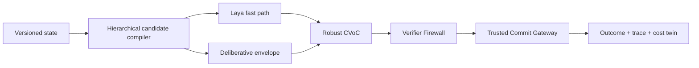

<p align="center">
  
</p>

<h1 align="center">C3R</h1>
<p align="center"><strong>Robust Calibrated Compute Control for Machine-Native Intelligence</strong></p>
<p align="center">
  <a href="https://github.com/ColomboAI-com/c3r/actions/workflows/ci.yml"></a>
  <a href="LICENSE"></a>
  
  
</p>

C3R is an open-core control plane that decides **which computation is worth performing next**.
It evaluates tools, retrieval, local and frontier models, verification, placement, and stopping as
typed candidates under one conservative value-of-computation policy.

The v0.1 vertical slice now includes bounded hierarchical candidate compilation, a revision-verified Laya
fast path with calibration-gated abstention, and a reproducible DecisionMix v1 schema preview.
It is a research alpha: the controller is runnable and tested; fine-tuned weights and empirical
production calibration remain release gates, not implied claims.

## Why C3R

Most agent stacks decide *what to say*. C3R decides *what computation should happen next*—and
keeps that recommendation separate from authority to act.



Hard masks run before candidate expansion. Missing calibration or an uncertain typed prediction
abstains. Learned components cannot grant permissions, select their authoritative verifier, turn
failed verification into success, or directly commit an external effect.

## What ships in this slice

| Surface | Included now |
| --- | --- |
| Candidate Compiler | family → subgroup → operation → arguments → placement → verifier; hard masks, budget pruning, caps, progressive widening |
| Laya fast path | exact upstream revision and license verification, typed probabilities, slice calibration, confidence/margin abstention |
| DecisionMix v1 | validated records, immutable deterministic splits, source/license provenance, SHA-256 manifest, 144-record synthetic preview |
| Authority boundary | action-bound verifier attestations, expiring single-use approvals, atomic nonce claims |
| Runtime control | conservative CVoC selection, deterministic `STOP`, cost twin, deliberative contracts, evidence-grade traces |

This compiler is the reviewed vertical slice, not the directive's full Candidate Compiler
Definition of Done. Rich typed value constraints, per-argument provenance, dominated-branch
pruning, and mandatory production placement policy remain explicit roadmap gates.

## Quick start

Core tests require only Python 3.11+:

```bash
python -m unittest discover -s tests -v
```

Install the optional pinned Laya integration:

```bash
pip install -e ".[laya]"
```

Build the identical DecisionMix schema preview and verify its hashes:

```bash
python scripts/build_decisionmix_preview.py
```

Minimal conservative selection:

```python
from c3r.cvoc import RobustCvocController
from c3r.state_schema import ActionCandidate, ActionFamily, RiskClass, ValueEstimate

candidate = ActionCandidate(
    id="retrieve",
    family=ActionFamily.RETRIEVAL,
    risk_class=RiskClass.READ_ONLY,
    optimistic_utility=0.7,
)
decision = RobustCvocController().select(
    (candidate,),
    {"retrieve": ValueEstimate(0.8, 0.2, 0.0, 0.1)},
)
```

If the conservative lower bound is not positive, `decision.selected` is `None` and the fallback
is `STOP`.

## Launch artifacts

- [C3R DecisionMix v1 Preview](https://huggingface.co/datasets/ColomboAI/C3R-DecisionMix-v1-preview)
  — published synthetic schema dataset with immutable splits and content hashes; its source is
  mirrored in [`data/decisionmix-v1-preview`](data/decisionmix-v1-preview).
- [C3R Decision Laya 421M v0.1](https://huggingface.co/ColomboAI/C3R-Decision-Laya-421M-v0.1)
  — integration-preview model card, exact base revision, both research papers, and machine-readable
  calibration/training/evaluation gates; no derived weights are claimed.
- [`docs/architecture.md`](docs/architecture.md) — trust boundaries and component contracts.
- [`docs/roadmap.md`](docs/roadmap.md) — what remains before production qualification.

## Laya integration

The adapter pins `convaiinnovations/laya` at
`1c5edc17a7acd8701df6fc341c0d179f1c62c982`. Before loading, the backend resolves the Hub
metadata, verifies that exact SHA and the Apache-2.0 license, downloads that revision, and passes
the local snapshot to `laya==0.3.5`.

The fast path answers fixed typed questions only. Every decision slice is keyed by question type,
action family, option-count bucket, language, and consequence class. A missing temperature,
insufficient top probability, or insufficient top-two margin returns an abstention signal that the
host orchestration must route to its deliberative envelope.

## DecisionMix v1

The [published preview](https://huggingface.co/datasets/ColomboAI/C3R-DecisionMix-v1-preview)
is intentionally synthetic. It validates the entire publication contract
without presenting generated fixtures as real training evidence. The empirical corpus will ship
only when provenance, licensing, held-out integrity, and calibration support are independently
auditable.

Required empirical metrics include accuracy, Brier score, ECE, maximum calibration error, NLL,
selective risk versus coverage, abstention, escalation, p50/p95 latency, throughput, calls avoided,
and cost per completed task.

## Feature flags

Production hosts must preserve independent control of:

```text
C3R_ENABLED
C3R_SYSTEM_ONE
C3R_DELIBERATIVE
C3R_ROUTING
C3R_SPECULATION
C3R_MOE_CONTROL
C3R_ONLINE_LEARNING=false
```

Disabling the learned fast path must leave the host's normal deterministic fallback operational.

## Release truth

Not yet claimed: trained `C3R-Decision-Laya-421M-v0.1` weights, empirical DecisionMix training
data, production provider adapters, MC-1 integration, Colibri control, or measured production
calibration/latency/cost results. They remain documented gates in the roadmap.

The upstream base is [Laya by Convai Innovations](https://huggingface.co/convaiinnovations/laya),
licensed Apache-2.0. C3R is a broader runtime architecture, not a fork or rebranding of Laya.
See [`NOTICE`](NOTICE) for the attribution boundary.

## Security and license

Do not report vulnerabilities in a public issue; follow [`SECURITY.md`](SECURITY.md). Production
effects must be completely mediated by an independently configured commit gateway.

Apache License 2.0. See [`LICENSE`](LICENSE). If you use C3R, cite [`CITATION.cff`](CITATION.cff).
