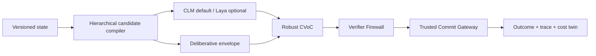

<p align="center">
  
</p>

<h1 align="center">C3R</h1>
<p align="center"><strong>Robust Calibrated Compute Control for Machine-Native Intelligence</strong></p>
<p align="center">
  <a href="https://github.com/ColomboAI-com/c3r/actions/workflows/ci.yml"></a>
  <a href="LICENSE"></a>
  
  
</p>

C3R is an open-core control plane that decides **which computation is worth performing next**.
It evaluates tools, retrieval, local and frontier models, verification, placement, and stopping as
typed candidates under one conservative value-of-computation policy.

The v0.1 vertical slice includes bounded hierarchical candidate compilation, a
calibration-gated System-One seam, and a reproducible DecisionMix v1 schema preview.
CLM is the new default System-One provider in code; Laya remains optional.
It is a research alpha: the controller is runnable and tested. Fine-tuned weights
and empirical calibration remain gates for the **empirical model/data release**,
not for the separate stateless recommendation API described below.

> **Launch status:** Neither the standalone decision service nor governed trace collection
> is enabled for public use. The independent [PR #2 review](https://github.com/ColomboAI-com/c3r/pull/2#pullrequestreview-5293835066)
> requests changes. A real cloud storage audit probe and the first natural
> empty-bucket purge run are recorded for reviewer inspection, but they do not
> establish deletion of aged traces or backups, trained weights, or calibration
> for the research release. The separate stateless API still needs its own
> security, live provider, and canary evidence. See the [reviewer packet](docs/reviewer-staging-packet-2026-09-23.md).

### Separate stateless API path

The [C3R Core API v1 contract](docs/stateless-core-api.md) separates a
recommendation-only, non-persistent inference service from the governed trace
collection and empirical-release program above. The current branch implements
the typed CLM API, direct ranking, a text-only Responses subset, a production
host, and a fail-closed `production_inference` mode. A private, loopback-only
candidate has returned actual CLM rankings and local DeepSeek text; it is
**not** a publicly launched or production-qualified API. Upstream CLM provides
advisory System-One ranking, not generative text or calibrated task-success
probabilities. `/v1/c3r/execute` remains disabled. `/v1/responses` invokes
DeepSeek through an admitted, independently checked text-only controller
fallback; it does not claim positive learned CVoC or expose private reasoning.
The first public hostname is a dedicated C3R endpoint, not an MC-1 integration.
See the [scope-specific release policy](docs/release-policy.md).

The [developer API guide](docs/developer-api.md) covers SDK examples, scoped keys,
tenancy, streaming, limits and privacy for the integration candidate. The
[branch reconciliation record](docs/release-reconciliation.md) explains how the
production and readiness histories were joined without losing reviewed source.

### Default language model

C3R's default **deliberative** language model is
[`deepseek-ai/DeepSeek-V4.1-Flash`](https://huggingface.co/deepseek-ai/DeepSeek-V4.1-Flash)
(MIT), self-hosted on the existing eight-H100 node alongside Qwen3-8B/CLM.
The default provider uses the private loopback `/model` alias; no OpenRouter or
hosted inference provider is part of the production target. CLM is the default separate
System-One decision engine; Laya remains optional. DeepSeek recommendations
remain subject to the same verifier and
trusted commit boundary as every other candidate.

The official checkpoint has passed a private 8×H100 GCP serving smoke test and is backed
up in a private GCS bucket. Its vLLM endpoint is bound to localhost; this is **not** a
public C3R service or end-to-end production qualification. The checkpoint's active
parameter count does not imply it fits on one GPU.

The recovered **older** serving image passed all 13 private C3R checks at 85%
GPU reservation with Qwen still running. The clean, pinned newer image is a
separate qualification target: its first startup rejected an obsolete flag.
The corrected launch configuration is tracked in
[`deploy/deepseek-v41`](deploy/deepseek-v41/README.md). Repeated cold starts,
sustained mixed load, outage/rollback, final-head builds, TLS and canary remain
required; recovery alone is not production qualification.

## Why C3R

Most agent stacks decide *what to say*. C3R decides *what computation should happen next*—and
keeps that recommendation separate from authority to act.


```mermaid
flowchart LR
    S[Versioned state] --> C[Hierarchical candidate compiler]
    C --> L[CLM default / Laya optional]
    C --> D[Deliberative envelope]
    L --> V[Robust CVoC]
    D --> V
    V --> F[Verifier Firewall]
    F --> G[Trusted Commit Gateway]
    G --> O[Outcome + trace + cost twin]
```

Hard masks run before candidate expansion. Missing calibration or an uncertain typed prediction
abstains. Learned components cannot grant permissions, select their authoritative verifier, turn
failed verification into success, or directly commit an external effect.

## What ships in this slice

| Surface | Included now |
| --- | --- |
| Candidate Compiler | family → subgroup → operation → arguments → placement → verifier; hard masks, budget pruning, caps, progressive widening |
| System-One fast path | CLM loopback rank adapter with strict response checks and calibration-gated abstention; optional revision-verified Laya |
| DecisionMix v1 | validated records, immutable deterministic splits, source/license provenance, SHA-256 manifest, 144-record synthetic preview |
| Authority boundary | action-bound verifier attestations, expiring single-use approvals, atomic nonce claims |
| Runtime control | conservative CVoC selection, deterministic `STOP`, cost twin, deliberative contracts, trace schema and optional transactional SQLite hash chain |
| Operational controls | fail-closed feature flags, tested frontier/open-weight HTTP contracts, Colibri shadow recommendations, canonical trace hash chain |
| Standalone controller boundary | tested state → candidates → optional System-One → CVoC → independent verifier → read-only recommendation or deterministic fallback → redacted trace composition; the standalone controller rejects external executors until effects and durable trace commits can be made atomic. A separate private Cloud Run staging host is fixed-disabled; it is not the decision service or a public launch. |

This compiler is the reviewed vertical slice, not the directive's full Candidate Compiler
Definition of Done. Rich typed value constraints, per-argument provenance, dominated-branch
pruning, and mandatory production placement policy remain explicit roadmap gates.

## Quick start

Core tests require only Python 3.11+:

```bash
python -m unittest discover -s tests -v
```

Install the optional pinned Laya integration:

```bash
pip install -e ".[laya]"
```

Build the identical DecisionMix schema preview and verify its hashes:

```bash
python scripts/build_decisionmix_preview.py
```

Minimal conservative selection:

```python
from c3r.cvoc import RobustCvocController
from c3r.state_schema import ActionCandidate, ActionFamily, RiskClass, ValueEstimate

candidate = ActionCandidate(
    id="retrieve",
    family=ActionFamily.RETRIEVAL,
    risk_class=RiskClass.READ_ONLY,
    optimistic_utility=0.7,
)
decision = RobustCvocController().select(
    (candidate,),
    {"retrieve": ValueEstimate(0.8, 0.2, 0.0, 0.1)},
)
```

If the conservative lower bound is not positive, `decision.selected` is `None` and the fallback
is `STOP`.

## Launch artifacts

- [C3R v0.1 Hugging Face collection](https://huggingface.co/collections/ColomboAI/c3r-robust-calibrated-compute-control-v01)
  — the model preview, DecisionMix preview, and attributed upstream Laya checkpoint in one release collection.
- [C3R DecisionMix v1 Preview](https://huggingface.co/datasets/ColomboAI/C3R-DecisionMix-v1-preview)
  — published synthetic schema dataset with immutable splits and content hashes; its source is
  mirrored in [`data/decisionmix-v1-preview`](data/decisionmix-v1-preview).
- [C3R Decision Laya 421M v0.1](https://huggingface.co/ColomboAI/C3R-Decision-Laya-421M-v0.1)
  — integration-preview model card, exact base revision, both research papers, and machine-readable
  calibration/training/evaluation gates; no derived weights are claimed.
- [`docs/architecture.md`](docs/architecture.md) — trust boundaries and component contracts.
- [`docs/roadmap.md`](docs/roadmap.md) — what remains before production qualification.
- [`docs/directive-compliance.md`](docs/directive-compliance.md) — evidence-backed audit against
  every Definition of Done item in Execution Directive v2.
- [`docs/empirical-release-plan.md`](docs/empirical-release-plan.md) — gated path from synthetic
  preview to trained, calibrated, independently reproducible release.
- [`docs/standalone-launch.md`](docs/standalone-launch.md) — current production exit gates,
  evidence status, and operator inputs, with MC-1 excluded from standalone scope only.
- [`docs/launch-announcement.md`](docs/launch-announcement.md) — canonical launch copy plus
  LinkedIn, X, and Hacker News variants with a publication checklist.
- [`docs/prior-art.md`](docs/prior-art.md) — explicit attribution links and the canonical novelty
  boundary required by the execution directive.

## CLM System-One integration

`C3R_SYSTEM_ONE_PROVIDER=clm` is the configuration default, while
`C3R_ENABLED` and `C3R_SYSTEM_ONE` still default to off. The adapter targets
the upstream [Contrastive-LM/CLM](https://github.com/Contrastive-LM/CLM)
`/v1/rank` API on a loopback-only origin. Its source is pinned at
`bb42c6c5bf914fd449bed2f6ca65be80602cb1f7` (Apache-2.0). The running
encoder and CLM head need their own immutable artifact revision, passed as
`C3R_CLM_ARTIFACT_REVISION`; the current adapter validates the declaration's
format but does not yet attest the live server's artifact hash. This repository
does not bundle or claim trained C3R-specific CLM weights. The host supplies `C3R_CLM_URL` (default
`http://127.0.0.1:8700`), an optional `C3R_CLM_API_KEY`, and a fitted
`TemperatureCalibrator` to `build_default_clm_fast_path`. The initial
`C3R_CLM_TIMEOUT_MS=500` bounds the complete System-One decision; production
latency thresholds still require live measurement.

CLM ranks bounded, policy-surviving candidate labels and fixed typed questions.
Its raw ranking is advisory, not an action selection. Missing calibration,
malformed responses, outages, or timeouts lead to abstention or deterministic
fallback. CVoC, independent verification, and the commit boundary retain
authority. Private live CLM ranking and co-resident DeepSeek recovery have been
observed; neither sustained GPU coexistence qualification nor held-out C3R
calibration is claimed by this code change.

## Laya integration

Laya remains an explicitly selected comparison/compatibility provider; it is not
the default System-One engine.

The adapter pins `convaiinnovations/laya` at
`1c5edc17a7acd8701df6fc341c0d179f1c62c982`. Before loading, the backend resolves the Hub
metadata, verifies that exact SHA and the Apache-2.0 license, downloads that revision, and passes
the local snapshot to `laya==0.3.5`.

The fast path answers fixed typed questions only. Every decision slice is keyed by question type,
action family, option-count bucket, language, and consequence class. A missing temperature,
insufficient top probability, or insufficient top-two margin returns an abstention signal that the
host orchestration must route to its deliberative envelope.

## DecisionMix v1

The [published preview](https://huggingface.co/datasets/ColomboAI/C3R-DecisionMix-v1-preview)
is intentionally synthetic. It validates the entire publication contract
without presenting generated fixtures as real training evidence. The empirical corpus will ship
only when provenance, licensing, held-out integrity, and calibration support are independently
auditable.

For the first empirical source, ColomboAI approved only C3R-authored internal
tasks under the [interim trace policy](docs/internal-task-trace-policy.md). It
sets a 30-day private retention limit and requires independent review before
any de-identified row is published. Collection remains off until the technical
controls are verified; this approval does not make the preview empirical.

Required empirical metrics include accuracy, Brier score, ECE, maximum calibration error, NLL,
selective risk versus coverage, abstention, escalation, p50/p95 latency, throughput, calls avoided,
and cost per completed task.

## Feature flags

Production hosts must preserve independent control of:

```text
C3R_ENABLED
C3R_SYSTEM_ONE
C3R_SYSTEM_ONE_PROVIDER=clm
C3R_DELIBERATIVE
C3R_ROUTING
C3R_SPECULATION
C3R_MOE_CONTROL
C3R_ONLINE_LEARNING=false
```

Disabling the learned fast path must leave the host's normal deterministic fallback operational.
`FeatureFlags.from_mapping` enforces those switches fail-closed and rejects autonomous online
learning. The reference provider and Colibri shadow contracts are documented in
[`docs/runtime-integrations.md`](docs/runtime-integrations.md).

## Release truth

Not yet claimed: C3R-trained CLM heads or Laya weights, empirical DecisionMix training
data, live provider qualification, MC-1 product integration, a Colibri shadow deployment, or
measured production calibration/latency/cost results. Tested adapter and shadow-control contracts
are included, but they are not represented as production runs. These remain documented gates.

The upstream base is [Laya by Convai Innovations](https://huggingface.co/convaiinnovations/laya),
licensed Apache-2.0. C3R is a broader runtime architecture, not a fork or rebranding of Laya.
See [`NOTICE`](NOTICE) for the attribution boundary.

## Security and license

Do not report vulnerabilities in a public issue; follow [`SECURITY.md`](SECURITY.md). Production
effects must be completely mediated by an independently configured commit gateway.

Apache License 2.0. See [`LICENSE`](LICENSE). If you use C3R, cite [`CITATION.cff`](CITATION.cff).

